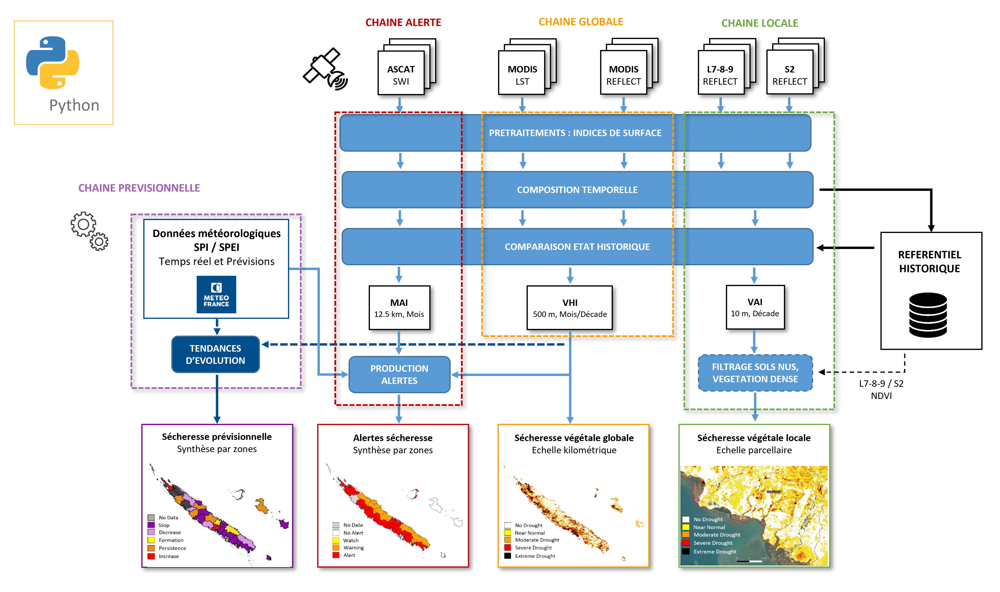
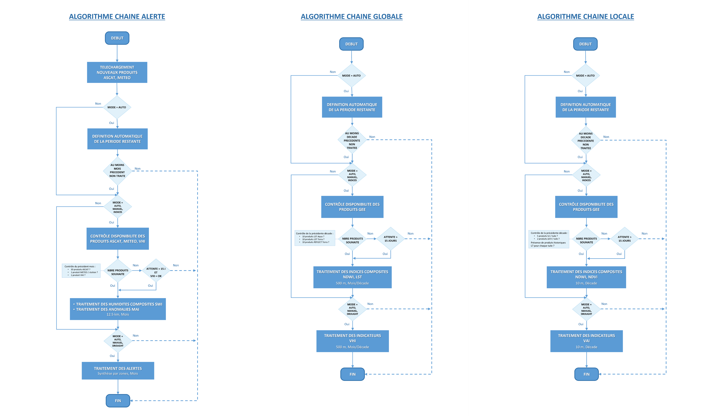

# EO4DM PIPELINE

## Table des Matières

- [Présentation générale](#présentation-générale)
- [Configuration Google Earth Engine (GEE)](#configuration-google-earth-engine-(gee))
- [Utilisation "Test"](#utilisation-"test")
- [Utilisation "Service-Régulier"](#utilisation-"service-régulier")
- [Algorithmes](#algorithmes)
- [Cas d'usages](#cas-d'usages)
- [Intégration Continue (CI)](#intégration-continue-(ci))

## Présentation générale

Ce dépôt contient la pipeline de traitement permettant la production des indicateurs de sécheresse développés dans le cadre du projet EO4DM	(Earth Observation For Drought Monitoring).
A la racine, se trouvent les fichiers servant à l'installation, l'intégration continue ainsi que la configuration de lancement de la pipeline.

Le dossier "[dmpipeline](dmpipeline)" contient les différents packages et scripts en python pour le traitement des produits intervenant dans la pipeline (images satellites, données météorologiques).
On y trouve les scripts principaux des trois chaines LOCALE, GLOBALE et ALERTE :
- [LocalDrought_ProcessingChain.py](dmpipeline/LocalDrought_ProcessingChain.py) : sécheresse végétale à haute résolution spatiale (10 m)
- [GlobalDrought_ProcessingChain.py](dmpipeline/GlobalDrought_ProcessingChain.py) : sécheresse végétale à moyenne résolution spatiale (500 m)
- [AlertDrought_ProcessingChain.py](dmpipeline/AlertDrought_ProcessingChain.py) : alertes sécheresse à échelle régionale (synthèse par zones)

Quatre sous-dossiers correspondent aux modules (packages) suivants :
- [ALERT_Processing](dmpipeline/ALERT_Processing) : scripts de la chaine Alerte et identifiants pour l'accès aux produits Copernicus ([ftp_accounts](dmpipeline/ALERT_Processing/ftp_accounts))
- [DROUGHT_Processing](dmpipeline/DROUGHT_Processing) : scripts pour le calcul des indicateurs sécheresse aux échelles locales et globales
- [GEE_Processing](dmpipeline/GEE_Processing) : scripts pour l'accès, le prétraitement et le téléchargement des produits GEE (Google Earth Engine), ainsi que les identifiants Google ([gee_accounts](dmpipeline/GEE_Processing/gee_accounts))
- [GEOSTATS_Processing](dmpipeline/GEOSTATS_Processing) : scripts pour le calcul de statistiques spatiales des indicateurs

Le sous-dossier [tests_notebooks](dmpipeline/tests_notebooks) contient des notebooks jupyter pour le test de certaines fonctionnalités des chaines. Certains tests unitaires restent à faire.

Le sous-dossier [ANNEX_Data](dmpipeline/ANNEX_Data) contient des données annexes pouvant être nécessaires à la pipeline :
- Landsat_Grid_World : contours des différentes tuiles landsat sur l'ensemble du globe, nécessairement utilisées par la chaine LOCALE
- Territory : exemple de données pouvant être utilisées par la chaine GLOBALE pour le calcul de statistiques spatiales (/Areas, /Landcover), et nécessairement utilisées par la chaine ALERTE (/Stations) . Ici, à titre d'exemple, les produits fournis sont ceux de la Nouvelle-Calédonie et devront être adaptés/modifiés pour d'autres territoires d'étude.

Un sous-dossier [DOC](dmpipeline/DOC) contient de la documentation utile.

La pipeline peut s'utiliser de deux manières :
- Utilisation "Test", pour un production en un seul coup, chaine par chaine, et qui est recommandée pour une première prise en main des chaines (cf. section [Utilisation "Test"](#utilisation-"test"))
- Utilisation "Service-Régulier, pour une production continue et parallelisée des chaines via un environnenent Docker, adaptée à la mise en place d'un service de production régulier (cf. section [Utilisation "Service-Régulier"](#utilisation-"service-régulier"))

## Configuration Google Earth Engine (GEE)

Pour collecter et prétraiter les produits satellites MODIS, LANDSAT-7-8-9 et SENTINEL-2, les chaines LOCALES et GLOBALES se basent sur l'API python GEE (earthengine-api).

Afin que la pipeline appelle correctement l'API, l'utilisateur doit au préalable :
1) S'enregistrer sur GEE et créer un projet dédié à l'utilisation de la pipeline (cf. [Register](https://code.earthengine.google.com/register))
2) Créer un compte de service Google dédié qui permettra l'authentification/initialisation automatique de l'API GEE à chaque lancement de la pipeline (cf. [Service Acccount](https://developers.google.com/earth-engine/guides/service_account))
3) Générer une clé privée au format JSON contenant les identifiants du compte
4) Placer la clé privée dans le dossier [gee_accounts](dmpipeline/GEE_Processing/gee_accounts) (cf. fichier exemple [eo4dm_service_key.json](dmpipeline/GEE_Processing/gee_accounts/eo4dm_service_key.json))

Depuis l'espace en ligne du projet GEE (Asset Manager, Code Editor) :
1) Créer un nouveau dossier 'Annex' (cf. [Managing Assets](https://developers.google.com/earth-engine/guides/asset_manager))
2) Importer le fichier [Landsat_Grid_World.zip](dmpipeline/ANNEX_Data/Landsat_Grid_World/Landsat_Grid_World.zip) dans 'projects/id-du-projet-gee/assets' (cf. [Importing Table Data](https://developers.google.com/earth-engine/guides/table_upload))
3) Déplacer le fichier Landsat_Grid_World dans 'Annex'

Pour la chaine LOCALE, il est possible de définir une zone selon laquelle les indices GEE seront découpés (par défault la découpe est faite selon l'emprise des tuiles Landsat). Pour cela :
1) Générer une couche vecteur au format shapefile contenant la (les) contour(s) de la zone (plusieurs polygones sont possibles)
2) Compresser dans un fichier zip nommé 'Landmask_Grid_ROI.zip'
3) Depuis l'espace en ligne du projet GEE, importer le fichier Landmask_Grid_ROI dans 'projects/id-du-projet-gee/assets', puis le déplacer dans 'Annex'

## Utilisation "Test"

Le fichier [setup.py](setup.py) installe les différents modules de la pipeline.

Les librairies python nécessaires sont :
- rasterio
- pandas
- geopandas
- gdal
- earthengine-api
- PyDrive
- python-dotenv
- setuptools
- scipy
- tqdm

### Fichier de configuration

Le fichier [Config_process.env](Config_process.env) configure le lancement des chaines. Plusieurs variables d'environnement sont à définir selon l'usage souhaité.
Pour une utilisation via Docker, ne pas modifier ce fichier et se référer directement à la section [Utilisation "Service-Régulier](#utilisation-service-régulier).

Les différentes variables de configuration et leur fonction sont décrites dans le fichier, dont certaines sont facultatives.
On y trouve tout d'abord les chemins vers les dossiers d'écriture (WRK_DIR) et de lecture (DATA_HISTO, ANNEX_DIR) des chaines, spécifiques à l'environnement d'installation de la pipeline.
Ensuite, un certain nombre de variables de fonctionnement permettent de paramétrer les traitements à réaliser. Voici les principales variables à renseigner :
- TERRITORY : nom anglais du Territoire/Pays à traiter, nécessaire dans GEE pour collecter les produits satellites
- MODE : Mode de fonctionnement des chaines (AUTO, MANUAL, INDICES, DROUGHT)
- PERIOD_START : Date de début de la période à traiter (inclusive)
- PERIOD_END : Date de fin de la période à traiter (exclusive)
- TILES_L : Nom des tuiles landsat à traiter (facultatif)
- TILES_S2 : Nom des tuiles sentinel-2 à traiter (facultatif)

### Installer via pip

Le fichier [libraries](libraries.txt) décrit les dépendances nécessaires.

S'assurer d'avoir installé virtualenv, se placer à la racine (dossier EO4DM), et exécuter :
```bash
python -m venv dmpipeline
source dmpipeline/bin/activate (linux)
./dmpipeline/Scripts/Activate.ps1 (windows)
pip install -r libraries.txt
python setup.py install
```

Installer `rasterio` avec pip peut être problématique, en particulier avec Windows (cf. [link](https://iotespresso.com/installing-rasterio-in-windows/)).
Si c'est le cas, privilégier conda.

### Installer via conda

Le fichier [environment.yml](environment.yml) décrit les dépendances nécessaires.

Exécuter :
```bash
conda env create --file environment.yml
conda activate dmpipeline
python setup.py install
```

### Exécution

Une fois le fichier de configuration complété, chaque chaine se lance de manière indépendante.
Ici, chaque chaine sera exécutée une seule fois sur la période et la région souhaitées. Une fois l'ensemble des indicateurs calculés, la chaine s'arrête et c'est à l'utilisateur de la relancer si nécessaire.

Exécuter la chaine locale :
```bash
localDM
```

Exécuter la chaine globale :
```bash
globalDM
```

Exécuter la chaine alerte :
```bash
alertDM
```

## Utilisation "Service-Régulier"

Il est possible de lancer et exécuter les différentes chaines via Docker.
Chaque chaine aura ainsi son conteneur Docker associé, mais basée sur une image commune qui contiendra l'ensemble des librairies nécessaires au projet en utilisant un environnement Conda. Cette image est basée sur Linux, avec une installation de Python et Conda :
- [Dockerfile](Dockerfile) contient les instructions pour la construction de l'image Docker
- [docker-compose.yml](docker-compose.yml) définit les services des différents dockers (variables entrées/sorties, image docker utilisée)

###  Fonctionement Docker

Afin de pouvoir exécuter la pipeline selon différents modes, le dockerfile lance le fichier [entrypoint.sh](entrypoint.sh). Celui-ci prend en entrée la variable d'environnement MODE définie dans le dockercompose et permettant un lancement :
- soit automatique et continue, qui fait appel au script python [control_autorun.py](control_autorun.py) dans lequel une boucle while exécute la chaine de traitement en continue
- soit en un seul coup (autres valeurs de MODE), équivalent à l'utilisation "Test" de la pipeline.

Tous les conteneurs sont regroupés dans le fichier [docker-compose.yml](docker-compose.yml) où il est possible de paramétrer le script à exécuter via des variables d'environnement. Ces variables sont ensuite lues par le fichier de configuration [Config_process.env](Config_process.env). S'assurer donc de bien remplir le dockercompose avec les variables attendues en configuration. Toute variable non fournie dans le dockercompose sera considérée comme None dans le fichier de configuration, ce qui entrainera une erreur si les variables obligatoires ne sont pas définies.

La variable d'environnement WRK_DIR est par défaut reliée à la variable définie dans le fichier [azure-pipelines.yml](azure-pipelines.yml) (cf. [Intégration Continue (CI)](#intégration-continue-(ci))). Dans le cas d'une utilisation sans CI de la pipeline, paramétrer directement le chemin du WRK_DIR dans le dockercompose (- WRK_DIR=chemin...).

Le fichier [docker-compose.yml](docker-compose.yml) décrit à minima 3 dockers pour le lancement des 3 chaines principales.
Néanmoins, il peut contenir autant de descriptions dockers que souhaitées, correspondant par exemple à différents cas d'usages : territoires, périodes, modes de lancements, etc.
S'assurer de garder les mêmes paramètres d'entrées/sorties, en les mettant à jour selon l'usage souhaité (TERRITORY=..., MODE=..., PERIOD=...).

Les logs des scripts sont redirigés vers la sortie du conteneur pour les voir apparaître dans les logs via `docker logs <container> -f`. 
Pour cela, la sortie des scripts est redirigée vers le fichier `/proc/1/fd/1` qui est en fait la sortie du conteneur.
L'instruction `2>&1` est également ajoutée pour que les erreurs soient retournées à la sortie du conteneur.

### Exécution Docker

S'assurer au préalable d'avoir installé Docker sur sa machine.

Pour construire, créer/recréer les dockers et démarrer en mode détaché (arrière plan), exécuter :
```bash
docker-compose up -d --build --force-recreate
```

Pour stopper les dokers, exécuter :
```bash
docker-compose down
```

## Algorithmes

Les différentes chaines de la pipeline, les étapes principales de traitements, ainsi que les produits d'entrée et de sortie, sont synthétisés dans le schéma [SCHEMA_GENERAL_EO4DM.png](dmpipeline/DOC/SCHEMA_GENERAL_EO4DM.png) :



Le fichier [ALGO_CHAINES_EO4DM.png](dmpipeline/DOC/ALGO_CHAINES_EO4DM.png) présente et décrit les algorithmes des chaines ALERTES, GLOBALES et LOCALES :


## Cas d'usages

/!\ NE TRAITE POUR LE MOMENT QUE LES CHAINES GLOBALES/LOCALES

S'assurer d'avoir correctement configuré l'accès à l'API GEE [Configuration Google Earth Engine (GEE)](#configuration-google-earth-engine-(gee)).

### Préparation du dossier ANNEX

Pour la chaine GLOBALE, s'il est prévu de fournir des statistiques spatiales par zones (DROUGHT_STATS=1) :
- Créer le dossier ANNEX à l'endroit correspondant au chemin ANNEX_DIR donné dans le fichier de config
- Y copier le dossier [Territory](dmpipeline/ANNEX_Data/Territory) et son contenu
- Renommer le dossier Territory selon le nom anglais du territoire à traiter, équivalent à la variable TERRITORY du fichier de configuration (en remplaçant les espaces et enventuels caractères spéciaux par des _)
- Placer dans le dossier [Areas](dmpipeline/ANNEX_Data/Territory/Areas) le shapefile contenant les contours des zones sur lesquelles seront calculées les statistiques
- Il est possible (facultatif) de masquer certaines surfaces à partir d'un masque d'occupation du sol ESRI contenu dans le dossier [Landcover](dmpipeline/ANNEX_Data/Territory/Landcover). Cette phase demande encore des développements et ne fonctionne que pour la Nouvelle-Calédonie (fichier [.tif](dmpipeline/ANNEX_Data/Territory/Landcover/58K_20200101-20210101.tif) fourni avec le code). Dans le cas où un autre territoire que la Nouvelle-Calédonie serait traité, veiller à supprimer le fichier .tif sinon une erreur surviendra au moment du calcul des statistiques.

Pour la chaine LOCALE, quelque soit la configuration de lancement :
- Créer le dossier ANNEX (si pas déjà fait) à l'endroit correspondant au chemin ANNEX_DIR donné dans le fichier de config
- Y copier le dossier [Landsat_Grid_World](dmpipeline/ANNEX_Data/Landsat_Grid_World)
- Dans le dossier Landsat_Grid_World, y décompresser le fichier zip

Le fichier de configuration [Config_process.env](Config_process.env) est à compléter selon les préconisations ci-dessous.

### Préconisations de configuration pour un premier test de lancement (MODE = MANUEL)

Pour un premier lancement des chaines sur un nouveau territoire, lancer celles-ci en mode manuel (MODE=MANUAL) sur une période d'un mois ou deux afin de vérifier la bonne exécution des différentes étapes de traitements ainsi que les produits fournis (indices, indicateurs).
Pour la chaine LOCALE, idéalement se placer sur une période diposant à la fois de produits Landsat et S2 (2019 - ce jour)

Les variables d'environnement ASSET_EXPORT_* permettent de conserver sur GEE (Assets) les indices mono-date prétraités. Cela peut être utile pour :
- Vérifier les indices mono-date en cas de production d'indices composites inattendus
- Gagner du temps lors de la relance de la chaine sur une période déjà traitée. Si les indices mono-date sont déjà présents sur GEE et que ASSET_EXPORT_*=1, la chaine vient directement les lire, permettant un calcul plus rapide par la suite des indices composites.

Pour la chaine GLOBALE :
- Définir la bounding box d'extraction des produits MODIS (lon_min, lat_min, lon_max, lat_max). A savoir que ce paramétrage est obligatoire lors du premier lancement, mais qu'il est ensuite facultatif pour de prochains lancements de la chaine sur la même zone (la chaine redécoupera ensuite les nouveaux indices selon l'emprise des produits historiques déjà calculés)
- Si calcul des statistiques spatiales, mettre DROUGHT_STATS à 1, et paramétrer KEY_STAT avec le nom du champ contenant les noms des zones (dans fichier shapefile du dossier [Areas](dmpipeline/ANNEX_Data/Territory/Areas)). KEY_STAT est facultatif, mais dans ce cas le champ doit être nommé 'nom'.

Pour la chaine LOCALE, les tuiles Landsat et S2 à collecter sur GEE peuvent être pré-définies par l'utilisateur pour réduire le nombre de produits satellites haute résolution à traiter. Cela peut être utile pour des premiers tests, afin de gagner du temps. Si aucune tuile n'est donnée, la chaine collectera automatiquement les tuiles interceptant le territoire (TERRITORY) ou la zone de découpe fournie par l'utilisateur via le fichier Landmask_Grid_ROI (si LANDMASK_ROI=1).

A l'issue des traitements, contrôler si les dossiers de sortie de run (WRK_DIR/RUN_*) contiennent bien les produits attendus selon les préconisations décrites dans le fichier [PROCEDURE_QUALITE_INDICATEURS](dmpipeline/DOC/PROCEDURE_QUALITE_INDICATEURS.xlsx).
Vérifier si les produits historiques sont également copiés vers le DATA_HISTO, à savoir :
- indices composites (décades, mois)
- indicateurs (décades, mois)
- table(s) contenant les séries temporelles des statistiques spatiales pour chaque zone (chaine GLOBALE, si calcul demandé depuis fichier de config).

#### Préconisations de configuration pour lancement historique (MODE = AUTO)

Lancer les chaines en mode AUTO pour que celles-ci calculent automatiquement le début et la fin de la période du référentiel historique, correspondant respectivement à la date du premier produit trouvé sur GEE et la date de fin de la décade complète la plus récente (inutile de remplir PERIOD_START et PERIOD_END).
Les chaines étant indépendantes, les référentiels historiques peuvent être différents d'une chaine à l'autre.

Mettre ASSET_EXPORT_* à 0 pour gagner du temps, ou alors s'assurer que suffisement d'espace est disponible sur GEE pour contenir l'ensemble des produits mono-dates. Pour la chaine LOCALE, les 250 Go d'espace GEE mis à disposition seront parfois insuffisants selon le territoire traité. Nous recommandons de ne pas paramétrer l'export sur GEE lors de l'exécution de la chaine LOCALE sur tout l'historique (2000 - ce jour).

A noter :  en utilisation sous docker ("Service-Regulier"), le mode AUTO permettra également de relancer automatiquement les chaines lorsque de nouveaux produits seront disponibles sur GEE (ce qui n'est pas le cas en utilisation "Test").

#### Calcul des indices ou indicateurs uniquement (MODE = INDICES/DROUGHT)

Il est possible de lancer qu'une partie des traitements de la chaine.

Le mode INDICE permet de calculer uniquement les indices composites en fixant manuellement la période de traitement. Peut s'avérer utile si besoin de recaculer les indices pour une période spécifique (produits erronés, pertes de données), puis relancer la chaine en mode AUTO par exemple.

Le mode DROUGHT permet de calculer uniquement les indicateurs. Cela implique de disposer au préalable d'un référentiel historique d'indices déjà calculés. Peut être utile pour mettre à jour les indicateurs sans recalcul des indices composites.
L'utilisateur peut donner une période en entrée qui définira les mois de l'année à recalculer, les indicateurs étant calculés par rapport à des anomalies a minima mensuelles (VHI), voire décadaires (VHI, VAI). Par exemple, le paramétrage 'PERIOD_START=2020-01-01' et 'PERIOD_END=2020-03-01' entrainera un calcul des indicateurs pour tous les mois de Janvier et Février disponibles (PERIOD_END est exclusive). Ici seul le numéro du mois compte dans ce qui est donné en entrée de PERIOD_START et PERIOD_END. Si aucune période n'est donnée, tous les mois de l'année disponibles seront mis à jour.

## Intégration Continue (CI)

### Agent Azure DevOps

L'installation de l'agent Azure DevOps, assurant le bon déploiement de ce projet sur le serveur INSIGHT, a été décrit dans une documentation interne de l'Oeil [Backup](https://dev.azure.com/Oeilnc/_git/Backup?path=/README.md&_a=preview) afin d'assurer une centralisation de l'information des procedures d'exploitation de l'infrastructure générale de l'Observatoire.

### Déclenchement

L'intégration continue (CI) ne se déclenche qu'à 2 conditions :
- un commit vient d'être poussé sur la branche master
- un tag vient d'être créé au format : v*.*.* (ex: v1.0.2)
Si un commit est poussé sur une autre branche que master ou si un tag est créé qui n'est pas au format indiqué, aucun déploiement ne sera exécuté.

Lorsqu'un commit est poussé sur le branche master, c'est le serveur de QUALIF qui est mis à jour.
Lorsqu'un tag est poussé (au bon format), c'est le serveur de PROD qui est mis à jour.

/!\ DOC PROJET BACKUP ??

Pour l'instant, seul l'agent Azure du serveur de QUALIF a été déployé, le serveur de PROD n'étant pas encore disponible.
Lorsque ce dernier sera disponible, il faudra créer un nouveau pool d'agent et y déployer un nouvel agent Azure dessus.
Pour ce faire, il suffit de suivre la documentation du projet Backup (partie `Installation d'un agent Azure sur un serveur extérieur`).
Il faudra ensuite modifier le fichier [azure-pipelines.yml](azure-pipelines.yml) de ce projet pour mettre à jour le nom du pool Azure dans le job qui déploie sur le serveur de PROD (cf. note #TODO).